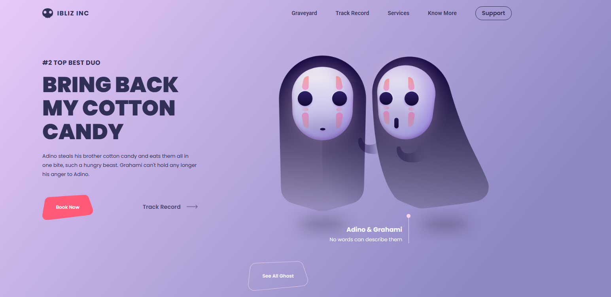

<h1 align="center"> Landing Page Halloween </h1>

<h2>OBJETIVO</h2>

Criar uma landing Page com o tema de Halloween, utilizando apenas html e css. A barra de navegação é animada, assim como os botões.

<h2> RESULTADO</h2>

<h2>ACESSE</h2>

https://tstavale.github.io/Landing_Page_Halloween/

<h2>FERRAMENTAS</h2>

<ul>
  <li>HTML</li>

  <li>CSS</li>

</ul>
